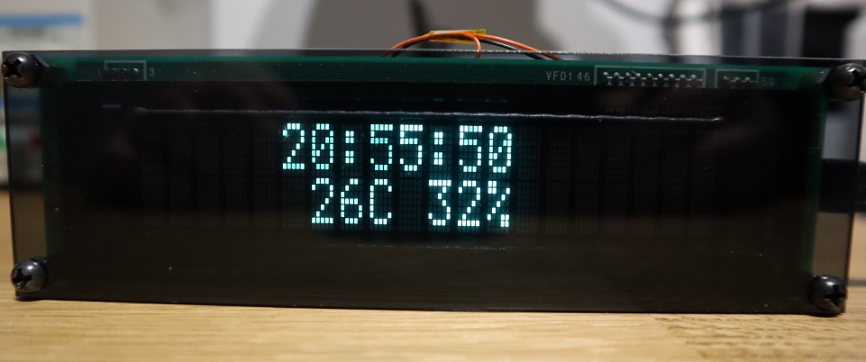
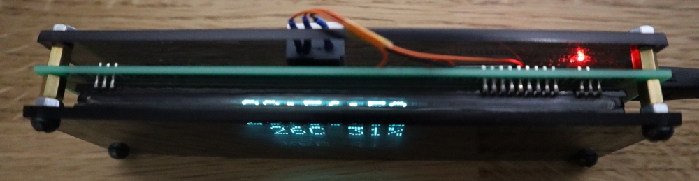
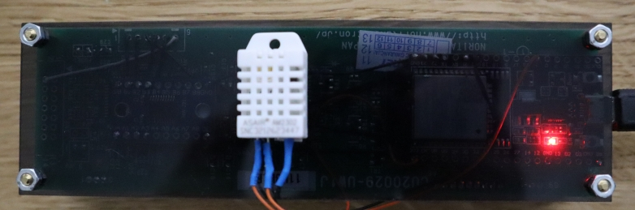

# Esp32Clock
Clock based on ESP32 with nice VFD display.

# About
Clock is based on Esp32 (node32s board), connected through logic level converter to Noritake display (CU20029-UW1J). Temperature and humidity is read by DHT11 sensor.

For handling communication between Esp32 and display I used my own implementation that I done for another project. There is also official implementation for Arduino provided by Noritake (https://www.noritake-elec.com/support/design-resources/support-guide/arduino-code-library-quick-start-guide). More powerful than my and should be easily portable to Esp32.

Display have two ports - parallel and serial. If you want to use serial port (as me) you have to connect pins 1 - 2 on JP3 (placed on the back of the screen).

# Schematic

# Setup
After first power on, clock will set up access point named _Esp32Clock_. Connect to that using your device and set up the network connection. After that clock will automatically connect to the pointed SSID. Access point will be set up also when clock will not be able to connect to saved network.
